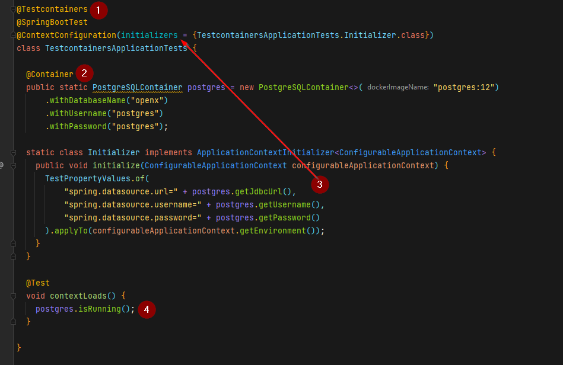
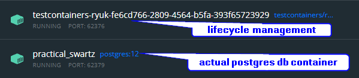
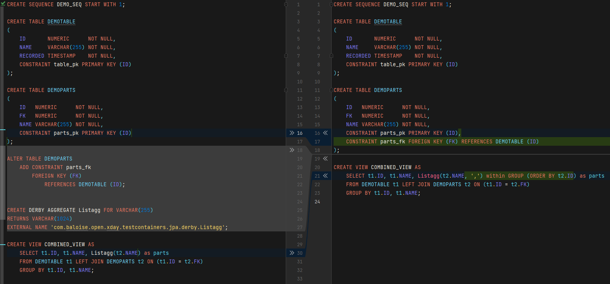
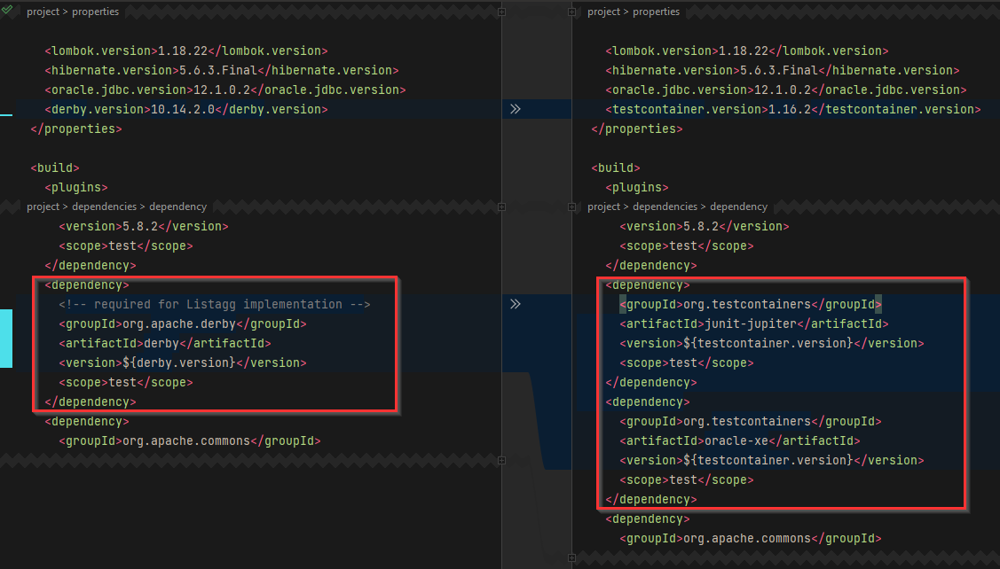

<!--
 * Copyright 2022 Baloise Group
 *
 * Licensed under the Apache License, Version 2.0 (the "License");
 * you may not use this file except in compliance with the License.
 * You may obtain a copy of the License at
 *
 *     http://www.apache.org/licenses/LICENSE-2.0
 *
 * Unless required by applicable law or agreed to in writing, software
 * distributed under the License is distributed on an "AS IS" BASIS,
 * WITHOUT WARRANTIES OR CONDITIONS OF ANY KIND, either express or implied.
 * See the License for the specific language governing permissions and
 * limitations under the License.
-->

# Agenda
1. [Motivation](#Motivation)
2. [What are testcontainers](#Top1)
3. [Example usage](#Top2)
4. [DB testing from scratch using flyway](#Top3)
5. [Migration from derby to oracle](#Top4)
6. [Limitations](#Top5)
7. [Conclusion](#Top6)


# <a id="Motivation"></a> Motivation
- DB/JPA unit tests using in-memory db like h2 or derby differ to much from real database with respect to
  - values (i.e. Inetger vs. BidDecimal) 
  - special DB functions (e.g. [Listagg][Listagg]) 
  - trigger, views, etc.
- Development based on local DB or any other local server vs. CI build (e.g. Jenkins, Github actions etc.) 


# <a id="Top1"></a> What are [testcontainers][Testcontainers]
> Testcontainers is a Java library that supports JUnit tests, providing lightweight, throwaway instances of common databases, Selenium web browsers, or anything else that can run in a Docker container.
> - ___Data access layer integration tests:___
> 
>    use a containerized instance of any database to test your data access layer code
> - ___Application integration tests:___
> 
>    for running your application in a short-lived test mode with dependencies, such as databases, message queues or web servers.
> - ___UI/Acceptance tests___:
> 
>    use containerized web browsers, compatible with Selenium, for conducting automated UI tests. Each test can get a fresh instance of the browser, with no browser state, plugin variations or automated browser upgrades to worry about.
>   


### Prerequisite
- [General Docker requirements][DockerEnvironment]
- A supported JVM testing framework like Junit(4/5), Spock or manually controlled

# <a id="Top2"></a> Example usage
1. Add maven dependency for entire lifecycle management
    ```xml
    <dependency>
      <groupId>org.testcontainers</groupId>
      <artifactId>testcontainers</artifactId>
      <version>1.16.2</version>
      <scope>test</scope>
    </dependency>
    ```
2. Add [certain testcontainer(s)](https://www.testcontainers.org/modules/databases/) you need to test on (e.g. Postgres)
    ```xml
    <dependency>
      <groupId>org.testcontainers</groupId>
      <artifactId>postgresql</artifactId>
      <version>1.16.2</version>
      <scope>test</scope>
    </dependency>
    ```
3. Configure testcontainer in your test class (e.g. JUnit5)
    ```java
    @Testcontainers
    class MyDbTestClass {
      ...
      @Container
      public static PostgreSQLContainer postgres = new PostgreSQLContainer<>("postgres:12")
         .withDatabaseName("openx")
         .withUsername("postgres")
         .withPassword("postgres");
      ...
      @Test
      void someTest() {
        ...
      }
    }
    ```


# <a id="Top3"></a>DB testing from scratch using [flyway](https://flywaydb.org/documentation/)
### Prerequisite
- start Postgres DB in order to run application (not testing)
  ```shell
  docker run --name openxday_2022-01-27 \ 
      -p 5432:5432 \
      -e POSTGRES_USER=postgres \
      -e POSTGRES_PASSWORD=postgres \
      -e POSTGRES_DB=openx 
    postgres:12
  ```
### Basic setup
- perform initial application loading test which succeeds `mvn test -f example-spring/pom.xml`
- for testing shutdown docker container `openxday_2022-01-27` and perform maven test build again `mvn test -f example-spring/pom.xml`
  
  Test will fail now, cause application does not start as db connection cannot be established any longer.
- Add Testcontainer as described in [previous chapter](#Top2).
  ```xml
  <dependency>
    <groupId>org.testcontainers</groupId>
    <artifactId>junit-jupiter</artifactId>
    <version>1.16.2</version>
    <scope>test</scope>
  </dependency>
  <dependency>
    <groupId>org.testcontainers</groupId>
    <artifactId>postgresql</artifactId>
    <version>1.16.2</version>
    <scope>test</scope>
  </dependency>
  ```
  
  
  1: Add Testcontainer capability
  
  2: Add and configure Postgres Container loaded from dockerhub using image [postgres:12](https://hub.docker.com/_/postgres) 

  3: Spring specific: overwrite config values commonly defined in [resources/application.yaml](example-spring/src/main/resources/application.yaml)

  4: access container (if necessary) within tests


- perform maven test build again `mvn test -f example-spring/pom.xml` and monitor it suceedes again (as CI build would do).
> While executing test you will notice two docker containers started:
> 

### Test with real data
- Create table ['Demotable'](https://github.com/arburk/open-x-day-testcontainers/blob/demo/DB_Testing_From_Scratch_WithData/example-spring/src/main/resources/db/migration/V1__initial_setup.sql) auto migrated using flyway
- Add related [JPA class](https://github.com/arburk/open-x-day-testcontainers/blob/demo/DB_Testing_From_Scratch_WithData/example-spring/src/main/java/com/baloise/open/xday/testcontainers/infrastructure/db/demo/DemoEntity.java) 
containing some testable logic (as well as related [repository](https://github.com/arburk/open-x-day-testcontainers/blob/demo/DB_Testing_From_Scratch_WithData/example-spring/src/main/java/com/baloise/open/xday/testcontainers/infrastructure/db/demo/DemoRepository.java))
- Add [first test](https://github.com/arburk/open-x-day-testcontainers/blob/demo/DB_Testing_From_Scratch_WithData/example-spring/src/test/java/com/baloise/open/xday/testcontainers/infrastructure/db/demo/DemoRepositoryTest.java) based on "real" database

review all required changes to steps above at feature branch [demo/DB_Testing_From_Scratch_WithData](https://github.com/arburk/open-x-day-testcontainers/tree/demo/DB_Testing_From_Scratch_WithData)

# <a id="Top4"></a> Migration from [derby](https://db.apache.org/derby/#What+is+Apache+Derby%3F) to [oracle](https://www.oracle.com/ch-de/database/technologies/)

### Major problems with different database test environment
- Special DB features not available (e.g., [Listagg][Listagg])
  
  Requires additional code implementing `org.apache.derby.agg.Aggregator` interface subsequently registed in derby:
  ```java
  public interface Aggregator<V, R, A extends Aggregator<V, R, A>> extends Serializable {
    
    void init();

    void accumulate(V var1);

    void merge(A var1);

    R terminate();
  }
  ```
  see example com.baloise.open.xday.testcontainers.jpa.[Listagg](example-jpa/src/test/java/com/baloise/open/xday/testcontainers/jpa/derby/Listagg.java)
  ```sql
  CREATE DERBY AGGREGATE Listagg FOR Numeric
  RETURNS VARCHAR(255)
  EXTERNAL NAME 'com.baloise.open.xday.testcontainers.jpa.Listagg';
  ```
- Types differ (Integer vs. BigDecimal)
  
  e.g. when executing a `count(*)` statement
- Syntax differ (e.g. Trigger)

  compare [init_oracle.sql](example-jpa/src/main/resources/init_oracle.sql) with [init_derby.sql](example-jpa/src/test/resources/init_derby.sql)

> ⚠ Partly different logic tested compared to execution in production ⚠
> 
> ⚠ Alternative SQL script required to setup test environment which needs maintenance ⚠
>  


### Migrate existing derby approach using Oracle testcontainer
- replace dependencies
  
- change base derby test to use testcontainer and remove all derby requried files
  - 🗑 test/java/com/baloise/open/xday/testcontainers/jpa/derby/Listagg.java
  - 🗑 test/resources/META-INF/persistence
  - 🗑 test/init_oracle.sql

>👍 Using production resources like [persistence.xml](example-jpa/src/main/resources/META-INF/persistence.xml) as well as [init_oracle.sql](example-jpa/src/main/resources/init_oracle.sql)
>
>👎 execution time increases as oracle db needs way more resources

Experience from productional change 
> 🛈 Oracle vs. Derby is +20 seconds for approximately 200 tests.
> Test derby ca. 1:10 minutes vs Oracle testcontainer 1:30 min.

# <a id="Top5"></a>Limitations

- [Docker runtime][DockerEnvironment] must be existent in order to use on local developer machine as well as on [CI environment](https://www.testcontainers.org/supported_docker_environment/continuous_integration/dind_patterns/).
- Jenkins support with podman >= v3

  🛈 If not available in CI environment use separate maven profile for local/CI build


# <a id="Top6"></a>Conclusion

- Test code/behaviour using real environment (not a mocked one)
- supports a wide range of systems out of the box, like
  - [Databases](https://www.testcontainers.org/modules/databases/)
  - Azure
  - Docker-Compose
  - Elasticsearch
  - Google Cloud SDK
  - AWS
  - Kubernetes
  - Kafka
  - Nginx
  - Solr
  - Webdriver 
  - ...
- Use own build containers by [GenericContainer](https://www.testcontainers.org/features/creating_container/)
  - Use any server available as container
  - Configure predefined test scenarios in dedicated testcontainer
- Easy to adopt and use
- ⚠ May slow down test execution depending on
  - number of containers used
  - startup time and resources required by used containers


[Testcontainers]: https://www.testcontainers.org/
[DockerEnvironment]: https://www.testcontainers.org/supported_docker_environment
[Listagg]: https://docs.oracle.com/cd/E11882_01/server.112/e41084/functions089.htm#SQLRF30030
